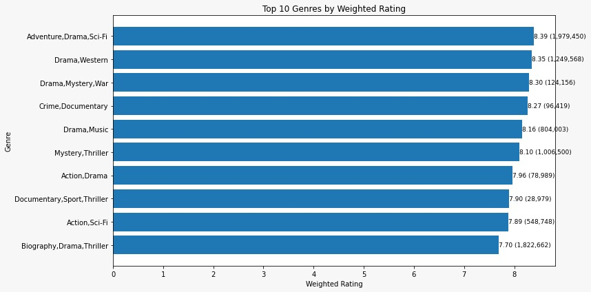
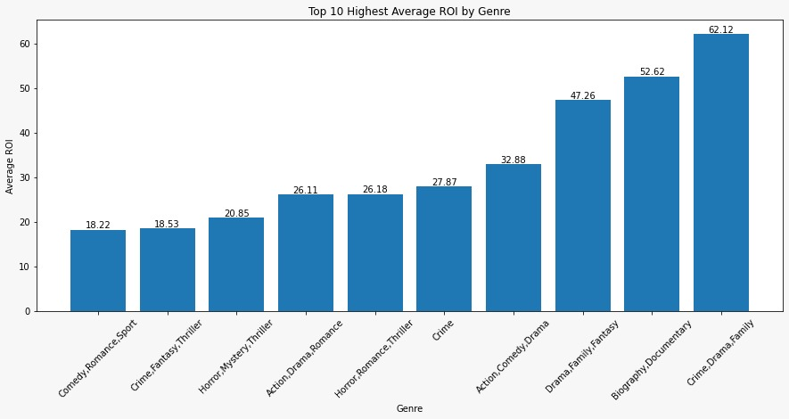
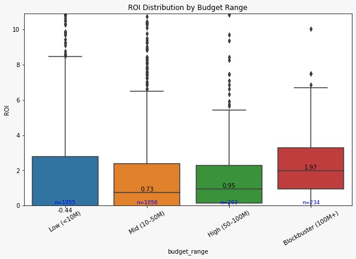

**Data-Driven Insights into Movie Box Office Success**
**Authors**:Group 5, Phase 2 Project( Reeves Gonah, Cynthia Jemutai, Eliud Kibet, Stephen Jilani, Mohamad Adan ) 

# #Overview
This project explores historical movie data to identify the key factors associated with box office success. By combining financial data with attributes such as genre, release timing, and audience reception, the analysis aims to highlight which types of films tend to perform well and why.

# Business Understanding
**Business Questions**
* The following are the key questions this analysis attempts to answer as they would directly inform procurement decisions:
1.  Which movie categories are the most popular? (To identify the market)
2.  Which movie categories are the most profitable? (To identify the popular-profitability relationship)
3.  What factors are affect the success of these movies(runtime, budget, etc)

# Data Understanding and Analysis

**Data Sources**: [Box Office Mojo](https://www.boxofficemojo.com/), [The Numbers](https://www.the-numbers.com/), [Internet Movie Datase - IMDB](https://www.imdb.com/), [The Movie Database - TMDB](https://www.themoviedb.org/) and [Rotten Tomatoes](https://www.rottentomatoes.com/)

## Tools and Technologies

**Python** – Data cleaning, analysis, and visualization   
**Pandas & NumPy** – Data manipulation and computation  
**Matplotlib & Seaborn** – Data visualization  
**SQLite3** – Accessing IMDb database tables

## Data preparation
The selected datasets were reloaded and examined to assess the integrity and quality of data
 ### Data Inspection and cleaning 
Checked column names, data types, and first few rows and Identified missing values,formatted the columns

### Data Merging 
Before cleaning all rows and columns, merging was necessary so as only to be left with rows of movies appearing on both datasets. The movie title was selected as the merging key and as such needed to be cleaned on both tables prior to merging
This new table was renamed as movie database

 ## Final Data
 _After cleaning and merging, the final dataset contained all relevant columns for analysis:
Based on the identified business objective and business questions, the following were the columns likely required:(GenreRevenue: domestic gross + worldwide gross
Budget,Popularity: rating+ numvotes,Title,Year,Studio,Datasets imdb and tn have all the information/columns necessary.
 imdb was selected as the primary dataset and tn(the numbers) as the secondary data

 ## Data Analysis and Visualization
After preparing the data, several analyses and visualizations were conducted to extract insights about the movie industry

**Business Objective I**: Which genres are the most popular?
Establish the top movie genres according to voters, based on rating.

  

From the Graph above, we can conclude that the most popular movies are of the drama genre in combination with high-engagement elements like sci-fi, adventure, or mystery

**Business Objective II**: Which genres are the most profitable?
Establish the relationship between the movie genre and the total profit to identify those with the most upside for the new in-house movie studio.  
Focus is done on the top 10 movie genres identified earlier

  

**Business Objective III**: What movie budget range maximizes return on investment (ROI) or profitability?
Identify the budget range that provides the most upsside for the new movie studio, to prevent or minimize sunken costs.

  

# # Business Recommendations
Recommendations were done based on the specific objectives i.e the business questions identified earlier.

**1.Identifying genres that are the most popular**
*   Focus on drama-driven hybrid genres with mass appeal (such as a combination with adventure, sci-fi)is likely to yield the best returns, while niche genres (such as documentary, sports, thriller) are better suited for targeted audiences.

**2.To establish the genre that generates the most revenue/Profit**
*   The studio should not rely on popularity alone when choosing what films to produce. Instead, it should focus more on genres and genre combinations (especially drama with other genres such as action comedy and crime) which have strong ROI potential

**3.To analyse the effect of budget range on return on investment (ROI)**
*   Focus on selectively investing in high-budget (100+ M) films, prioritizing projects with strong success indicators (e.g., established franchises or proven talent), to maximize ROI while managing the risks associated with large-scale production.

*   
## Conclusion
Overall, the analysis shows that successful film production decisions require a balance between targetting audience appetite, revenue potential, and strategic investment. While popular genres attract wide audiences, the most profitable outcomes come from thoughtful genre combinations and well-targeted high-budget projects. In particular, blending drama genre with commercially strong genres (such as action and adventure) and selectively backing high-budget productions offers the best opportunity to maximize returns

